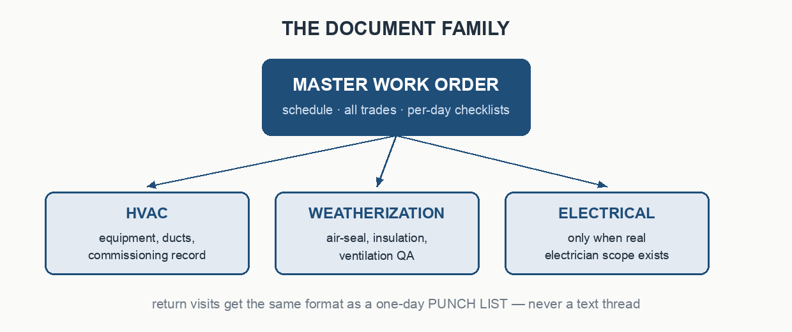

# Crew Work Orders


A complete, rebrandable template system for **crew-facing work orders** in
residential trades — HVAC, weatherization/insulation, electrical. Built from
a working retrofit contractor's real document standard, generalized so any
company can adopt it: one config file carries your branding, one markdown
file carries each job, and a generator renders branded `.docx` work orders a
first-week tech can run the day from.

It's also a **Claude skill**: import the folder and Claude learns the whole
method — interviewing for missing job facts, routing scope to trades,
phasing the days, generating the docs, and holding the line on the hard
rules (no prices on crew docs, no unresolved blanks, photos required).



## Why it exists

Most shops keep this knowledge in one scheduler's head and a folder of
inconsistent Word docs. This package makes the method explicit and portable:


- **The day plan is physics, not preference.** Open the cavity first, run
  every penetration while it's open, air-seal before insulating, let the
  blower door gate the blow, QC on its own day. `reference/day-phasing.md`
  locks the invariants and collects your archetypes.
- **Checklists are data.** Every QA checklist is a small markdown file with
  a trigger regex. Add your program's inspection items by dropping in files —
  no code changes. Later directories override earlier ones, so a program
  overlay (see the PCEF example) replaces generics cleanly.
- **A lint, not a vibe.** `wo_lint.py` fails any doc with a price, an
  unresolved placeholder, or AI attribution, and flags options-language,
  negative instructions, and ventilation-ratio drift for review.

## Quickstart (5 minutes)

```bash
pip install python-docx
```

```bash
python3 scripts/build_work_orders.py examples/resilient-retrofits/jobs/alder-st/
```

That renders the worked example — a gas-furnace-to-heat-pump + attic job for
a fictional customer — into `examples/resilient-retrofits/jobs/alder-st/output/`
as four branded work orders (MASTER, HVAC, WEATHERIZATION, ELECTRICAL), then
lints them. Open the MASTER and you're looking at the target output.

Now make it yours:

1. Edit `config/company.md` — name, license #, crew phone line, two brand
   colors, your logo (or leave blank for a wordmark banner).
2. Re-render the same example against YOUR config:

```bash
python3 scripts/build_work_orders.py examples/resilient-retrofits/jobs/alder-st/ --config config/company.md
```

3. Start a real job: copy `templates/job-intake.md` to
   `jobs/{job-name}/job.md`, fill it (no prices, no guesses), add
   `photos/` + `photos/captions.md`, and run the generator on it.

## Import into Claude

**Claude Code:** copy this folder to `~/.claude/skills/crew-work-orders/`
(or `.claude/skills/crew-work-orders/` inside a project). Then just ask —
"build a work order for the Henderson job" — and Claude follows the method,
including the never-assume rule: it interviews you for anything missing
instead of inventing it.

**claude.ai / Claude desktop:** zip this folder (SKILL.md must sit at the
zip root) and upload it as a custom skill under Settings → Capabilities.

**No Claude at all:** everything works as a plain repo — read
`reference/`, fill the intake, run the two scripts. Python 3.9+ and
`python-docx` are the only requirements (Pillow only if you regenerate
graphics with `tools/make_graphics.py`).

## The worked example

`examples/resilient-retrofits/` is a real company's configuration —
[Resilient Retrofits](https://resilientretrofits.com), a Portland, OR home
performance contractor (forest-green branding, Oregon CCB license line, a
PCEF/Energy Trust program checklist overlay with inspector question numbers,
and a 1:300 attic ventilation standard). The **job is fictional**: "Casey
Alder" and the sample schematics exist so the package ships with zero real
customer data. The example's phone number is a `555` placeholder — put a
real crew-lead cell in yours.

Study it to see every extension point in use: custom colors + real logo,
`qa_label` renamed to the program inspector, an overlay checklist directory,
and a filled intake with a phased 2-day + QC schedule.

## Package map

```
crew-work-orders/
├── SKILL.md                     Claude skill — the method, triggers, hard rules
├── README.md                    you are here
├── config/company.md            ← the one file that rebrands everything
├── templates/job-intake.md      per-job fill-in (becomes jobs/{name}/job.md)
├── scripts/
│   ├── build_work_orders.py     job.md + config → branded .docx set + lint
│   ├── wo_lint.py               deterministic hard-rule gate (CI-safe exit codes)
│   ├── brand.py                 config-driven docx branding layer
│   └── docx_helpers.py          brand-neutral python-docx primitives
├── checklists/                  generic QA libraries (one .md per checklist)
├── reference/
│   ├── document-format.md       sections, family, naming, delivery
│   ├── day-phasing.md           invariants + archetypes + schedule block
│   └── content-rules.md         the hard rules and why each exists
├── examples/resilient-retrofits/  fully-worked real-company example
├── assets/                      logo placeholder (swap for yours)
├── docs/img/                    diagrams (rebuild: tools/make_graphics.py)
└── tools/make_graphics.py       every graphic regenerates from code
```

## Extending it

- **New checklist / program overlay** — add `.md` files to a directory and
  list it in the config's `checklist_dirs` (format documented in SKILL.md).
- **New archetype** — when a job doesn't fit, phase it deliberately, then
  write the day table into `reference/day-phasing.md` so the next one fits.
- **New doc type** (punch list, per-visit packet) — copy a builder function
  in `build_work_orders.py`; the brand layer keeps it on-style for free.
- **Restyle the graphics** — palette lives at the top of
  `tools/make_graphics.py`; one command rebuilds everything.

Work orders here carry no prices by design — pricing belongs in your
estimate system and customer proposal, never on a crew doc.

## License

MIT — see [LICENSE](LICENSE). The Resilient Retrofits name and logo in the
example folder are their owner's property, included only as a worked
configuration; swap in your own branding before shipping documents.
