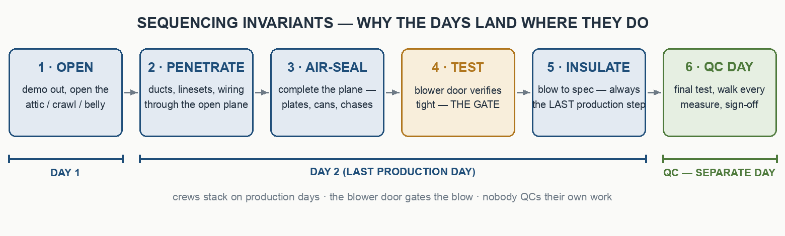

# Day Phasing — Breaking a Job into Crew Days

The document format says how a work order looks. This doc says **how a job
gets broken into days** — the part that usually lives in one scheduler's head.
Phase the job here first; then record the result in job.md's Day Plan.

## Sequencing invariants — locked

Physics and QC rules that decide which day each measure lands on. They hold
on any envelope + mechanical retrofit; they are not preferences.

1. **Demo/removal opens the space first.** Old equipment out and the cavity
   (attic, crawl, belly) opened on Day 1, so everything that follows has room.
2. **Run every penetration while the plane is open.** Linesets, range-hood
   duct, bath-fan duct, and wiring that crosses the ceiling/floor plane go in
   BEFORE the air barrier is finished. The weatherization crew holds those
   spots on Day 1 and seals around the ducts after the mechanical crew runs them.
3. **Air-seal before you insulate.** The full plane air seal — top plates,
   can lights, penetrations, chases — is complete before any insulation covers it.
4. **The blower door gates the blow.** Blown insulation is the LAST
   production step, only after the air barrier verifies tight against the
   assessment baseline. Cellulose over a leaky plane is buried rework.
5. **Prep before blow.** Baffles at every eave bay, hatch dam and
   weatherstrip, depth markers, ventilation net-free-area check — all before
   the machine starts.
6. **Install crews stack on production days.** Mechanical + weatherization
   share the site so the install compresses into the fewest days the scope
   allows, finishing on the last production day.
7. **QC is a separate, non-production day.** Final blower door + a
   walkthrough of every measure + homeowner sign-off. Nobody QCs their own
   work while a blower is running.

## Trade routing

Ventilation ductwork — **range hood and bath fans — belongs to the
mechanical/HVAC crew**: they run the ducts (usually Day 2, through spots the
weatherization crew held open), and weatherization seals around them after.
New circuits and panel work are the electrician's doc; a simple
disconnect/reconnect stays with the install crew.

## Archetype A — small single-family electrify + envelope (2 production days + QC)

Gas furnace → heat pump, attic air-seal + blow, minor electrical, ~700–1,100 sf.

| Day | Crews | Work |
|---|---|---|
| Day 1 | HVAC · WX | HVAC: pull old furnace, cap fuel at the appliance, haul ducts · WX: vacuum out attic, START air sealing, hold the hood/fan duct spots |
| Day 2 | HVAC · WX | HVAC: set heat pump + linesets, run range-hood + bath-fan ducts, commission · WX: finish air seal, seal around new ducts, prep attic · blower door · blow to spec |
| QC Day | Assessor / lead | Final blower door · walk every measure · homeowner sign-off |

Booking rules to copy into the master:
- The attic opens Day 1 so every duct runs Day 2 before anything is sealed or blown.
- Both install crews on site Days 1–2; install finishes Day 2.
- Blow LAST — only after the air barrier verifies tight.
- QC day is non-production.

## Archetype B — manufactured home, belly + full electrify (5 production days + QC)

The belly (underfloor cavity) replaces the attic — same invariants, worked
inverted, with one big difference: **the belly is a serial resource.** One
trade under the home at a time (open → run penetrations → air-seal subfloor →
insulate → close), which is the main day-count driver. Ventilation-ratio
checks for attics do NOT apply to a belly. Water heater swaps complete in ONE
day — the occupied home is never without hot water overnight. The blower door
runs AFTER doors and shell work complete, as the final envelope test.

| Day | Crews | Work |
|---|---|---|
| Day 1 | Mech · WX · Elec | WH swap (one day, reuse existing circuit) · open the belly · run + energize the one new circuit |
| Day 2 | Mech · WX | Finish demo · under-floor penetrations · subfloor air-seal (belly stays open) |
| Day 3 | Mech · WX | Set heat pump + commission · bath fan + range hood ducted out |
| Day 4 | Mech · WX | Belly LAST step: insulate + close rodent-tight · hang exterior doors |
| Day 5 | Assessor · WX | Blower door after shell complete · appliance sets · final punch |
| QC Day | Assessor + lead | Permit finals · results documented · walkthrough + sign-off |

## Day-count guidance

Two poles, interpolate honestly: a 3-trade attic SFH ≈ 2 production days + QC;
a manufactured-home whole-home with a belly ≈ 5 + QC (the belly alone is ~3
serial crew-days). Windows, doors, and appliance counts push days up; a
single-measure job (water heater only) is 1 day + a same-visit QC pass.

## The Schedule block

Every MASTER carries: the **Day · Crews · Work table**, the **booking-rules
bullets** (why the order is locked), and a **"Book these dates:"** fill-in
line per day. The per-day sections then repeat as full checklists with a
"DAY N COMPLETE" gate at the end of each.

## Capture your own archetypes

When a job doesn't fit an archetype, don't guess and don't one-off it: ask
whoever owns scheduling, then write the answer INTO this file as a new
archetype table. The standard grows one captured job at a time — that's the
whole point of keeping it in the package.
